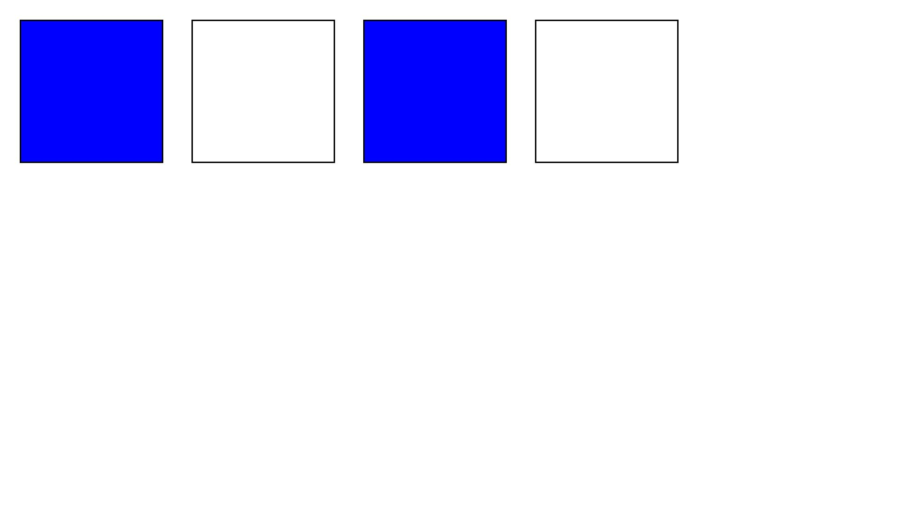

Card matching game

In this game the user is supposed to click one card and then match it with another card if the second card doesn't match the first then both cards flip back over and you have to restart.

How It's Made:
Tech used: HTML, CSS, JavaScript, jquery

I made a condition that determined if the first card turned over was equal to the second card then they would stay flipped over. If they didn't the class would be removed and the card would turn back over. I also added a function that determined if all the cards are flipped over at the same time then the game is over.

Optimizations:
Due to time constraints I wasn't able to add more cards to the game but when I get a chance I will.

Lessons learned:
I tried to simply use the same conditions and add more cards but it didn't work. This helped me learn that sometimes even though things work on a smaller scale they might not exactly translate to a bigger scale
